# SpamProxy

Transparenter AntiSpam-Proxy mit Postfix, rspamd, KI-Klassifizierung, ClamAV Virenscanner und Web-Interface.

SpamProxy wird als MX vor den eigentlichen Mailserver geschaltet und filtert eingehende sowie ausgehende E-Mails. Spam wird in eine Quarantäne verschoben, wo Benutzer Mails freigeben oder ablehnen können.

## Screenshots

| | |
|---|---|
| 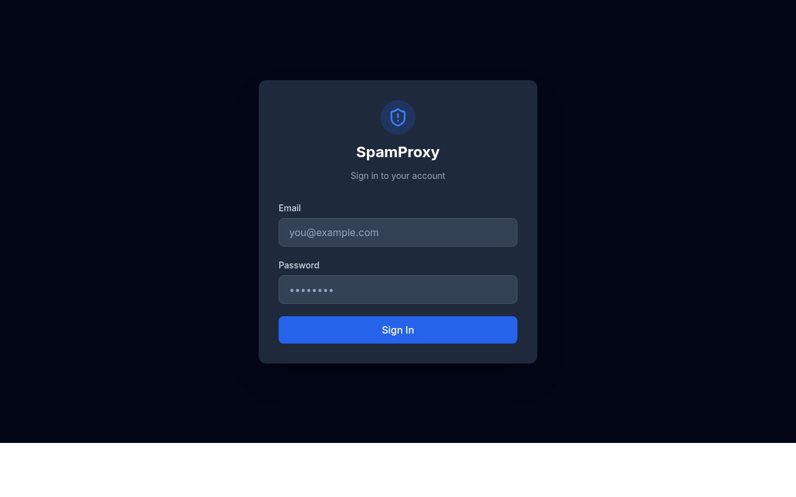 | 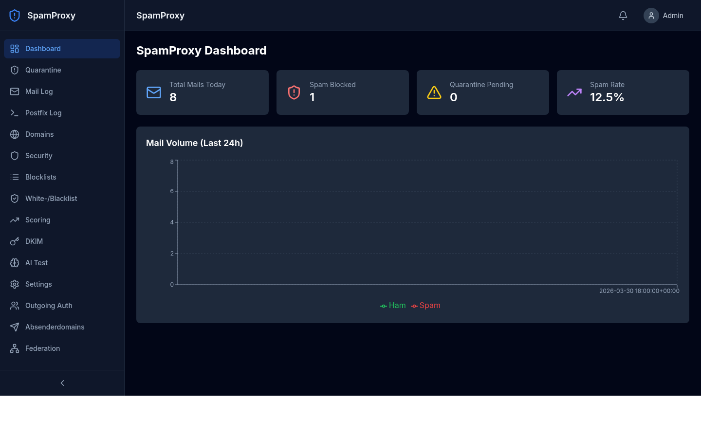 |
| Login | Dashboard |
| 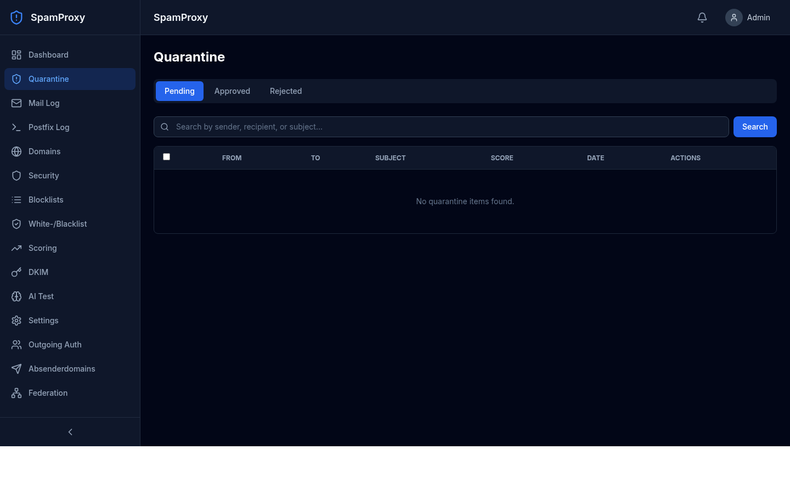 | 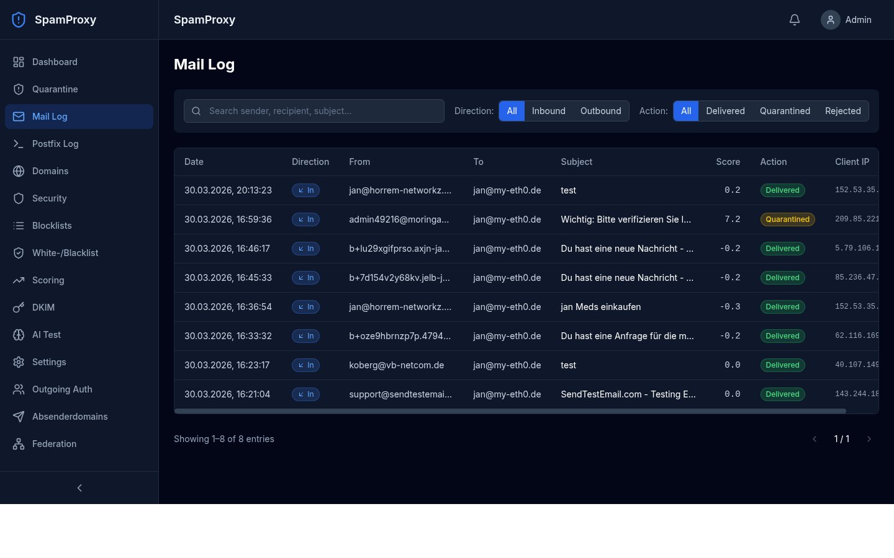 |
| Quarantäne | Mail-Log |
| 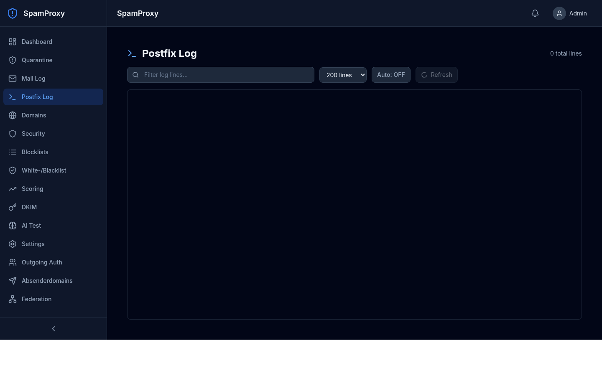 | 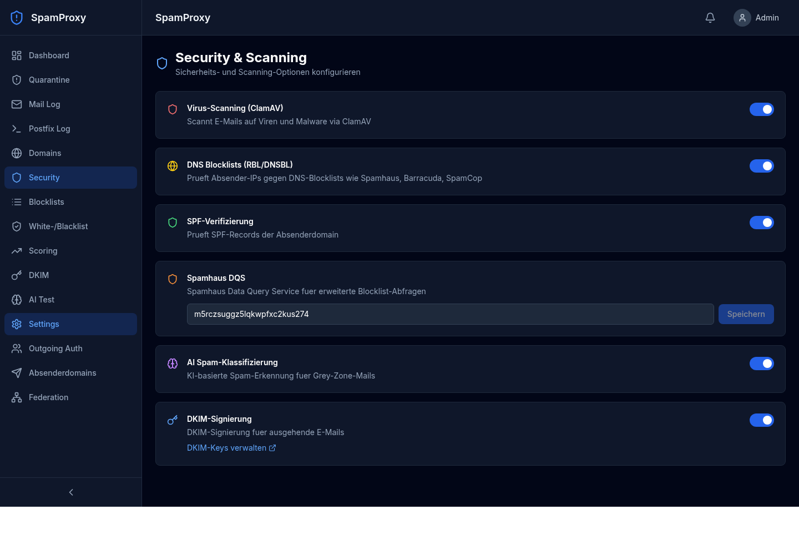 |
| Postfix-Log | Security & Scanning |
| 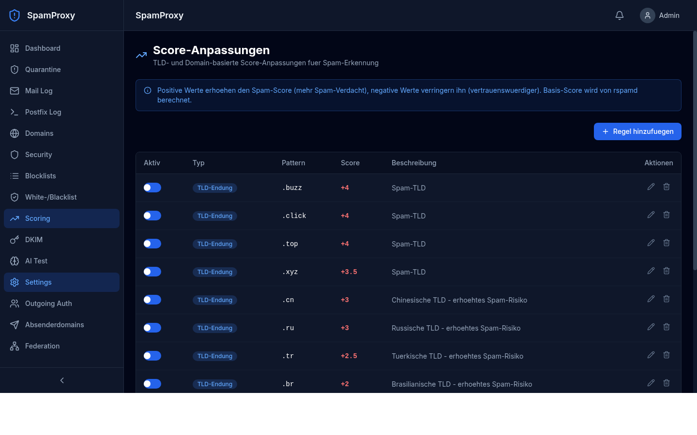 | 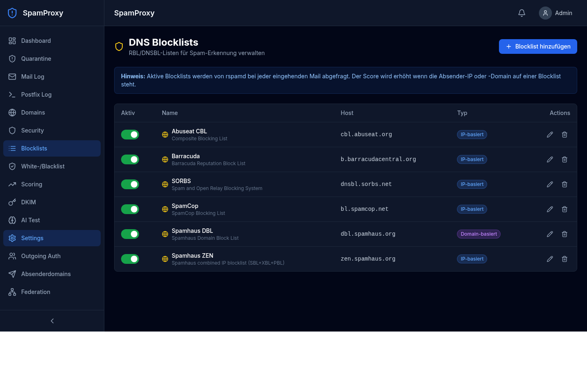 |
| Score-Anpassungen | DNS Blocklists |
| 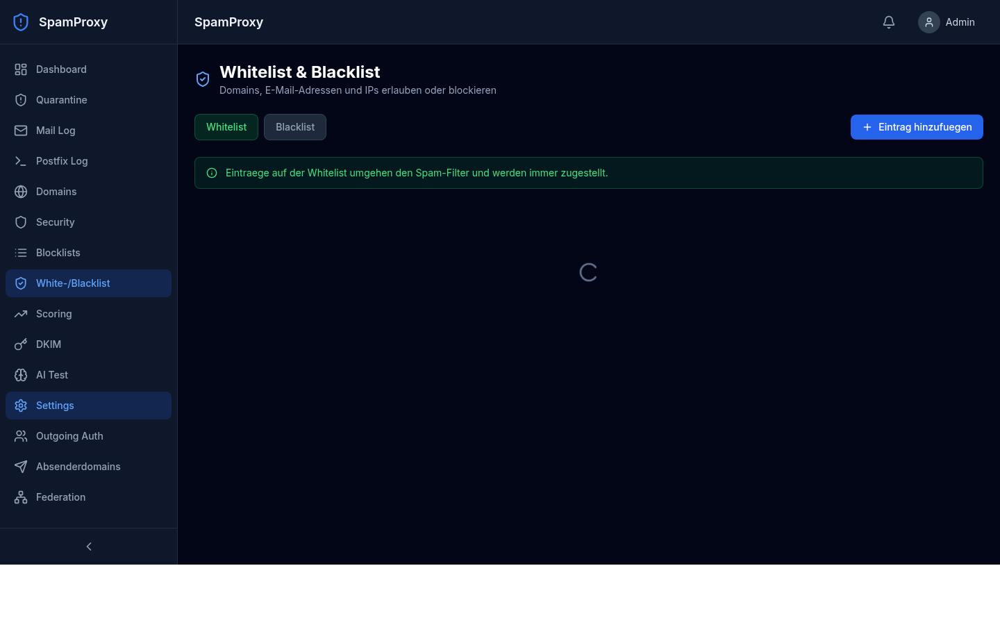 | 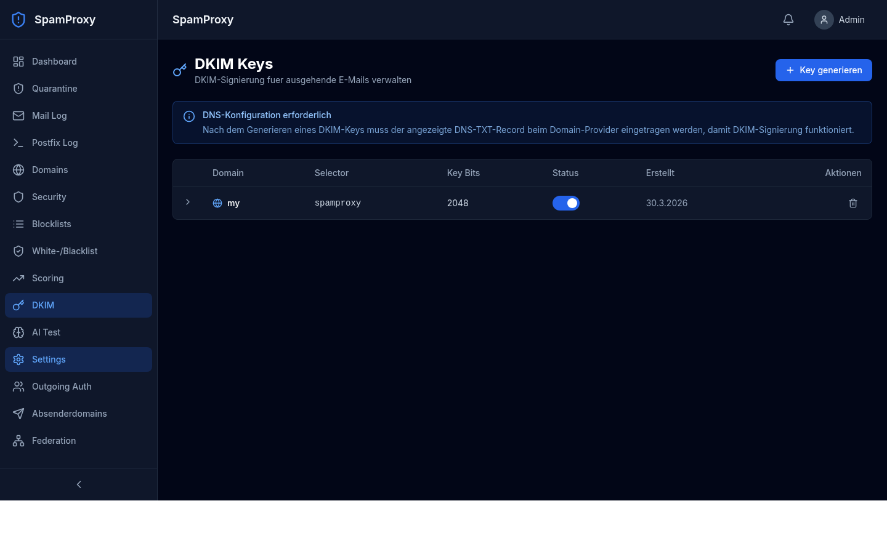 |
| Whitelist / Blacklist | DKIM Keys |
| 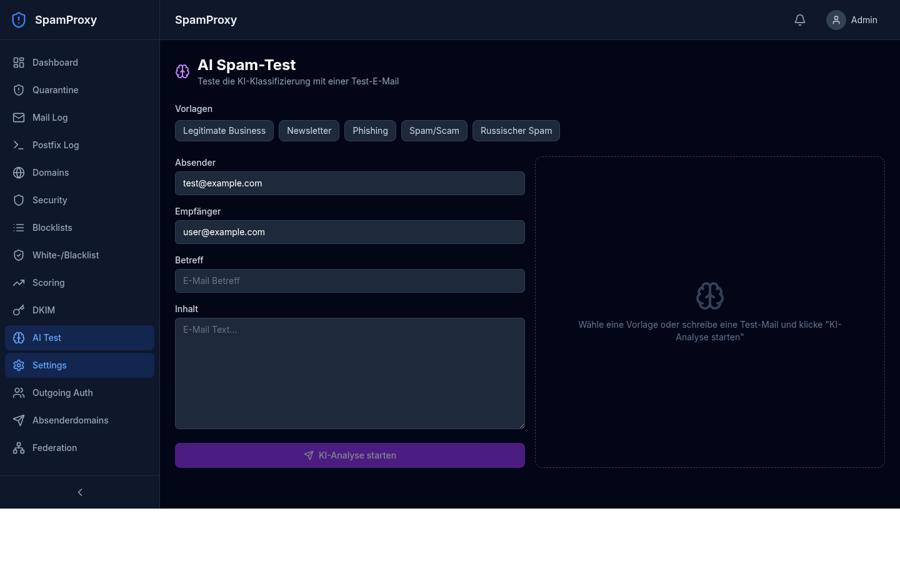 | 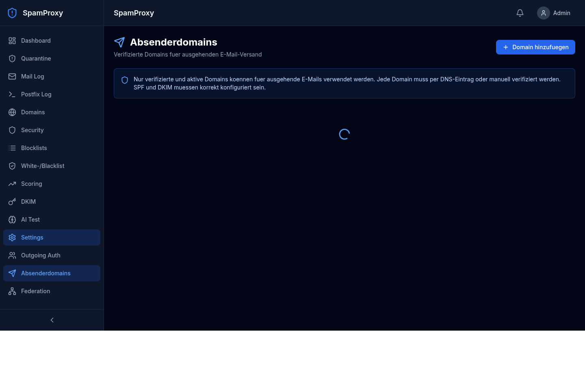 |
| AI Spam-Test | Absenderdomains |
| 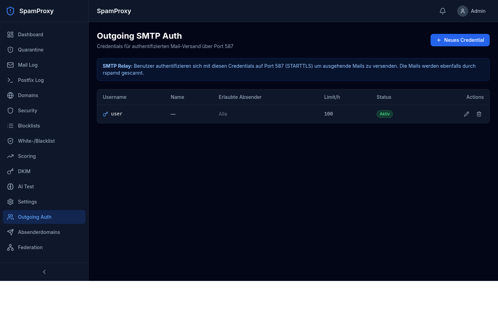 | 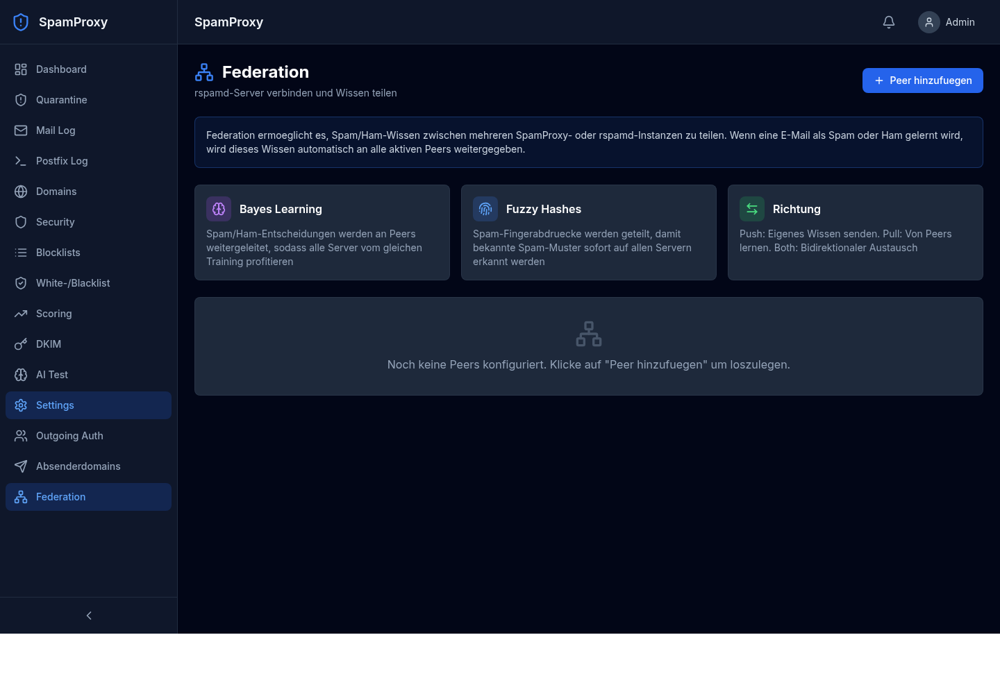 |
| Outgoing SMTP Auth | Federation |
| 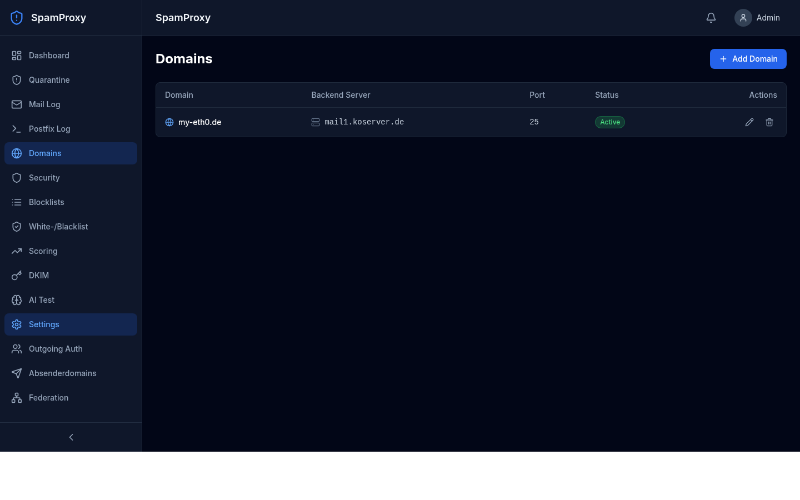 | 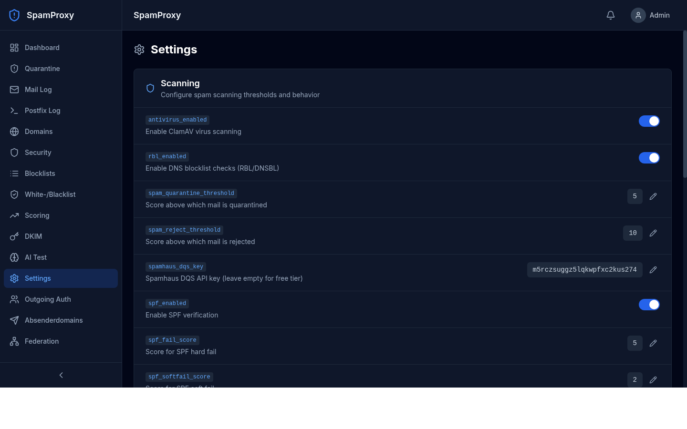 |
| Domain-Routing | Einstellungen |

## Features

### Mail-Verarbeitung
- **Postfix** als SMTP-Frontend (Port 25 inbound, Port 587 outbound mit SASL-Auth)
- **rspamd** als Milter für Spam-Scoring (Bayes, Fuzzy-Hashing, DKIM/SPF/DMARC)
- **KI-Klassifizierung** für Grey-Zone-Mails (OpenAI oder Ollama)
- **ClamAV** Virenscanner
- **Quarantäne** mit Approve/Reject im Web-Interface
- **Content-Filter** loggt jede Mail und entscheidet: deliver / quarantine / reject

### DNS & Authentifizierung
- **SPF-Verifizierung** eingehender Mails
- **DKIM-Signierung** ausgehender Mails (Key-Generator im Web-Interface)
- **DNS Blocklists** (Spamhaus, Barracuda, SpamCop, SORBS u.a.)
- **Absenderdomain-Verifizierung** für Outgoing (DNS-Token oder manuell)
- **SMTP-Auth** für ausgehenden Versand (SASL über Dovecot-Protokoll)

### Scoring & Filterung
- **Whitelist/Blacklist** für Domains, E-Mails, IPs, CIDR-Netze
- **TLD-basierte Score-Anpassungen** (z.B. .ru +3.0, .de -1.0)
- **Domain-basierte Scoring-Regeln**
- **Per-Domain Backend-Routing** (jede Domain kann einen eigenen Mailserver haben)

### Federation
- **Bayes-Learning-Sync** zwischen mehreren SpamProxy/rspamd-Instanzen
- **Fuzzy-Hash-Austausch** für Spam-Fingerprints
- Push/Pull/Bidirektionaler Modus
- Verbindungstest im Web-Interface

### Web-Interface
- **Dashboard** mit Echtzeit-Statistiken und Charts
- **Quarantäne-Management** (Liste, Vorschau, Approve/Reject, Bulk-Actions)
- **Mail-Log** mit Filter und Suche
- **Postfix-Log** mit Auto-Refresh und Farbhervorhebung
- **Domain-Verwaltung** (Inbound-Routing pro Domain)
- **Security-Einstellungen** (ClamAV, RBL, SPF, AI, DKIM toggles)
- **Blocklist-Verwaltung** (DNS-Blocklists hinzufügen/entfernen)
- **White-/Blacklist** (Domains, IPs, E-Mails)
- **Scoring-Regeln** (TLD/Domain-basiert)
- **DKIM-Key-Generator** mit DNS-Record-Anzeige
- **AI-Test** (Test-Mails mit Vorlagen klassifizieren)
- **Absenderdomain-Verifizierung** mit SPF/DKIM/MX-Checks
- **Outgoing-Auth-Verwaltung** (SMTP-Credentials)
- **Federation** (rspamd-Peers verwalten)
- **Allgemeine Einstellungen** (Thresholds, AI-Config, etc.)

## Architektur

```
Internet ──► Port 25 ──► Postfix ──► rspamd (Milter) ──► Content-Filter (Python)
                                                              │
                                                    ┌────────┼────────┐
                                                    ▼        ▼        ▼
                                                 Deliver  Quarantine  Reject
                                                    │        │
                                                    ▼        ▼
                                               Backend    PostgreSQL
                                              Mailserver    (DB)
                                                              │
Internet ──► Port 587 ──► Postfix (SASL) ──► rspamd ──► Content-Filter
             (Submission)                                     │
                                                      Domain-Check
                                                      (verifiziert?)

Browser ──► Port 443 ──► Nginx ──► Next.js Web-Interface
                                       │
                                       ▼
                                   mail-service (FastAPI)
                                       │
                                       ▼
                                   PostgreSQL
```

### Container

| Service | Image | Ports | Funktion |
|---|---|---|---|
| postfix | Custom (Debian) | 25, 587 | SMTP-Relay mit rspamd-Milter |
| rspamd | rspamd/rspamd | 11333*, 11334*, 11335* | Spam-Scanner |
| mail-service | Custom (Python) | 8024*, 8025*, 12345* | Content-Filter, API, SASL |
| web | Custom (Next.js) | 3080* | Web-Interface |
| postgres | PostgreSQL 17 | - | Datenbank |
| redis | Redis 7 | - | rspamd-Backend (Bayes, Fuzzy) |
| clamav | ClamAV | - | Virenscanner |

\* nur intern oder via Nginx

## Quick Start (Entwicklung)

```bash
cp .env.example .env
# .env anpassen
docker compose up -d
# Web-Interface: http://localhost:3080
# Login: admin@example.com / changeme
```

## Production Deployment

### Voraussetzungen

- VPS mit min. 2 GB RAM, 20 GB Disk
- Docker + Docker Compose
- Nginx
- Domain mit DNS-Zugriff

### Installation

```bash
# 1. Projekt auf Server bringen
git clone https://github.com/JanKoIT/SpamProxy.git /opt/spamproxy
cd /opt/spamproxy

# 2. Erstinstallation (generiert sichere Passwoerter)
./scripts/deploy.sh first-install

# 3. .env anpassen
nano .env
# Setze: PROXY_HOSTNAME, ADMIN_EMAIL, AI_API_KEY

# 4. Nginx + TLS einrichten
sudo cp docker/nginx/spamproxy.conf /etc/nginx/sites-available/spamproxy
sudo nano /etc/nginx/sites-available/spamproxy  # Domain anpassen
sudo ln -s /etc/nginx/sites-available/spamproxy /etc/nginx/sites-enabled/
sudo certbot --nginx -d mail.example.com
sudo systemctl reload nginx

# 5. Backups einrichten
sudo ./scripts/setup-cron.sh

# 6. DNS konfigurieren (bei deinem DNS-Provider)
# A-Record:   mail.example.com → VPS-IP
# MX-Record:  example.com → 10 mail.example.com
# SPF:        example.com TXT "v=spf1 a:mail.example.com ~all"
```

### Update

```bash
cd /opt/spamproxy
git pull
./scripts/deploy.sh update
```

Das Update-Script:
1. Erstellt automatisch ein DB-Backup
2. Baut geänderte Container neu
3. Führt ein Rolling-Update durch (minimale Downtime)

### Backup

```bash
# Manuelles Backup
./scripts/backup.sh full        # Alles (DB + DKIM + Redis + Config)
./scripts/backup.sh db          # Nur Datenbank

# Automatische Backups einrichten
sudo ./scripts/setup-cron.sh    # Täglich 02:00 full, alle 6h DB

# Restore
./scripts/restore.sh backups/spamproxy_full_20260330.tar.gz
./scripts/restore.sh backup.tar.gz --component db    # Nur DB
```

### Federation

Mehrere SpamProxy-Instanzen verbinden:

```bash
# Auf Server A: Peer B hinzufuegen
./scripts/deploy.sh federation-add 5.6.7.8 "Server-B"

# Auf Server B: Peer A hinzufuegen
./scripts/deploy.sh federation-add 1.2.3.4 "Server-A"

# Dann im Web-Interface unter Settings > Federation die Peers konfigurieren
```

### Verwaltung

```bash
./scripts/deploy.sh status           # Service-Status
./scripts/deploy.sh logs             # Alle Logs
./scripts/deploy.sh logs postfix     # Nur Postfix
./scripts/deploy.sh backup           # Manuelles Backup
./scripts/deploy.sh federation-list  # Federation-Peers
```

## Konfiguration

### .env Variablen

| Variable | Beschreibung | Default |
|---|---|---|
| `PROXY_HOSTNAME` | Hostname des Proxy-Servers | proxy.example.com |
| `POSTGRES_PASSWORD` | PostgreSQL-Passwort | changeme |
| `NEXTAUTH_SECRET` | Session-Secret | (generiert) |
| `ADMIN_EMAIL` | Admin-Login E-Mail | admin@example.com |
| `ADMIN_PASSWORD` | Admin-Passwort (Erstlogin) | changeme |
| `AI_PROVIDER` | openai oder ollama | openai |
| `AI_API_KEY` | OpenAI API-Key | - |
| `AI_MODEL` | KI-Modell | gpt-4o-mini |
| `QUARANTINE_RETENTION_DAYS` | Quarantäne-Aufbewahrung | 30 |
| `TZ` | Zeitzone | Europe/Berlin |
| `FEDERATION_BIND` | Bind-IP für Federation | 0.0.0.0 |

### Web-Interface Einstellungen

Alles weitere wird im Web-Interface konfiguriert:
- Spam-Thresholds (Quarantäne ab Score 5, Reject ab 10)
- AI Grey-Zone (Score 3-7 löst KI-Analyse aus)
- ClamAV, RBL, SPF, DKIM ein/ausschalten
- Blocklists verwalten
- Scoring-Regeln anpassen
- Domains und Backend-Server zuordnen

## Sicherheit

- Alle internen Ports (DB, Redis, rspamd, API) sind nicht von außen erreichbar
- Web-Interface nur via Nginx/TLS
- HSTS, X-Frame-Options, CSP Headers
- Rate-Limiting auf Web und Federation
- bcrypt Passwort-Hashing
- Federation-Ports per UFW auf Peer-IPs beschränkt
- Absenderdomains müssen für Outgoing verifiziert werden

## Tech Stack

- **SMTP**: Postfix
- **Spam-Scanner**: rspamd
- **Virus-Scanner**: ClamAV
- **Backend**: Python 3.12, FastAPI, SQLAlchemy, aiosmtpd
- **Frontend**: Next.js 15, TypeScript, Tailwind CSS, Recharts
- **Datenbank**: PostgreSQL 17
- **Cache**: Redis 7
- **Deployment**: Docker Compose

## Lizenz

MIT
