# SpamProxy

Transparent AntiSpam mail proxy with Postfix, rspamd, AI classification, ClamAV virus scanning and web interface.

SpamProxy is placed as MX in front of your actual mail server and filters both incoming and outgoing emails. Spam is moved to a quarantine where users can approve or reject messages.

## Screenshots

| | |
|---|---|
|  |  |
| Login | Dashboard |
|  | 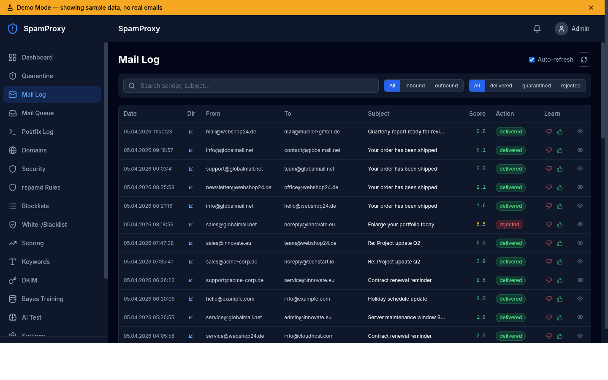 |
| Quarantine | Mail Log |
| 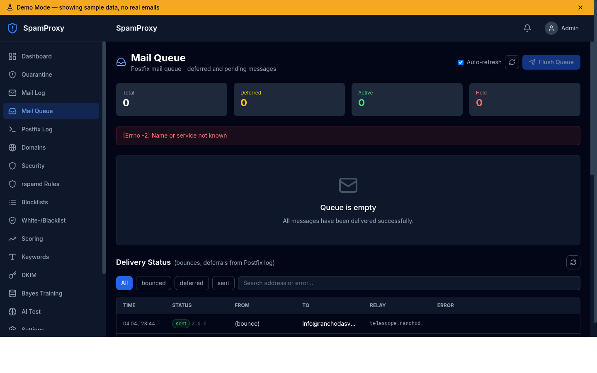 |  |
| Mail Queue | Postfix Log |
| 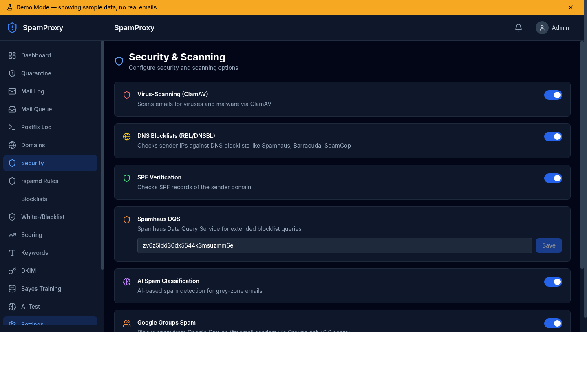 | 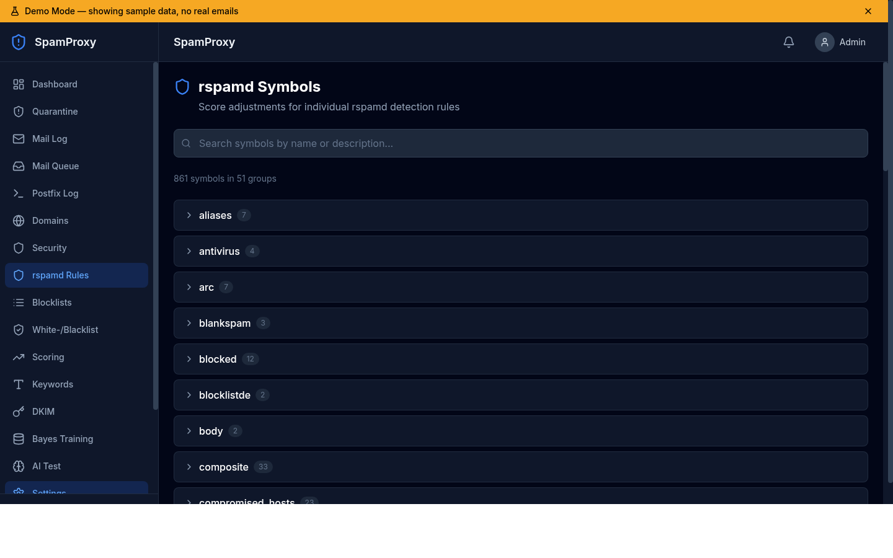 |
| Security & Scanning | rspamd Rules |
| 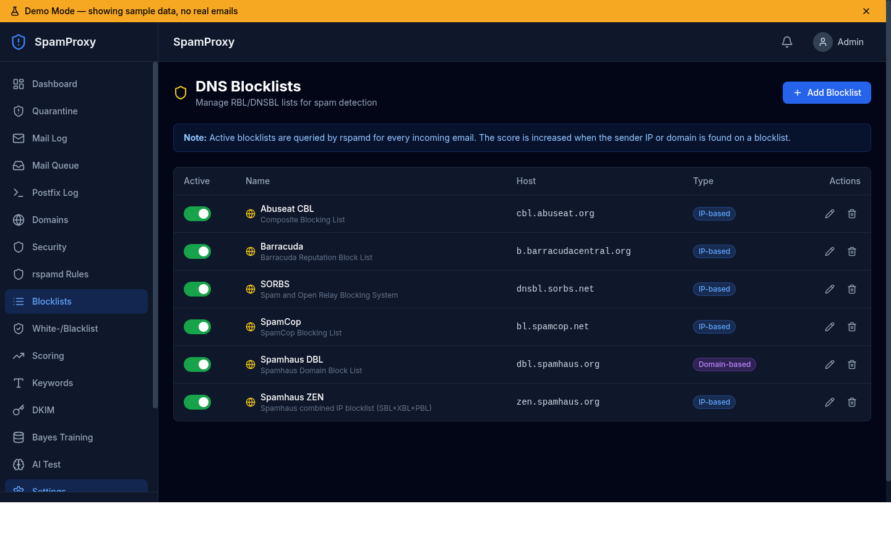 | 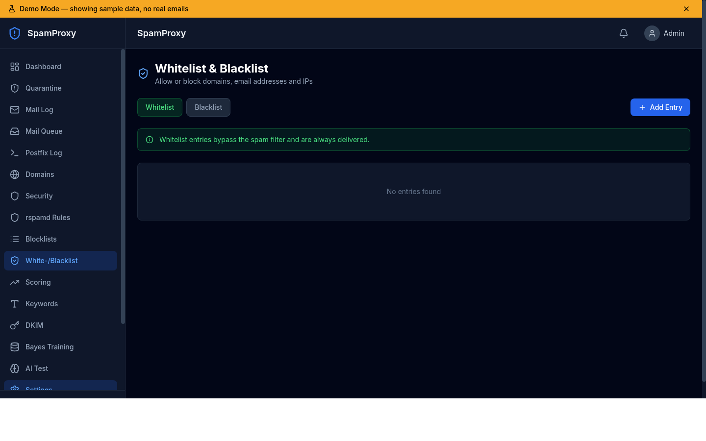 |
| DNS Blocklists | Whitelist / Blacklist |
| 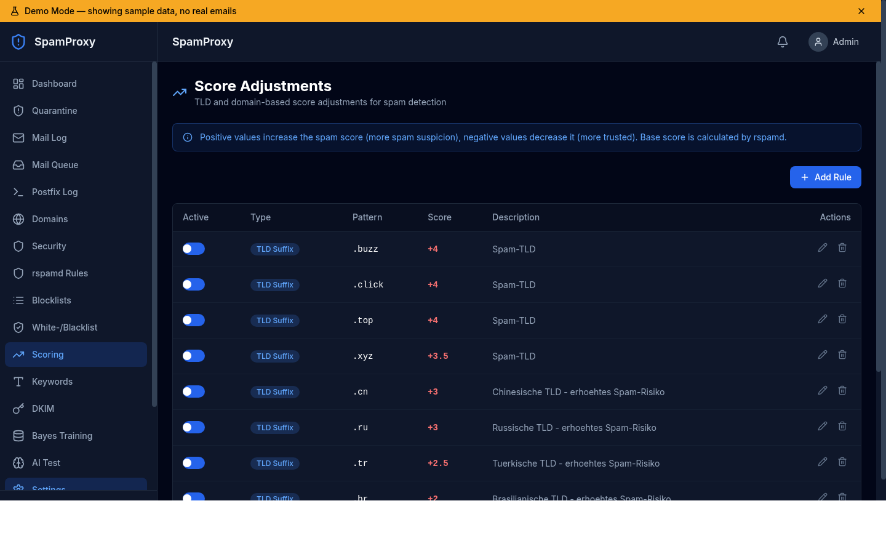 | 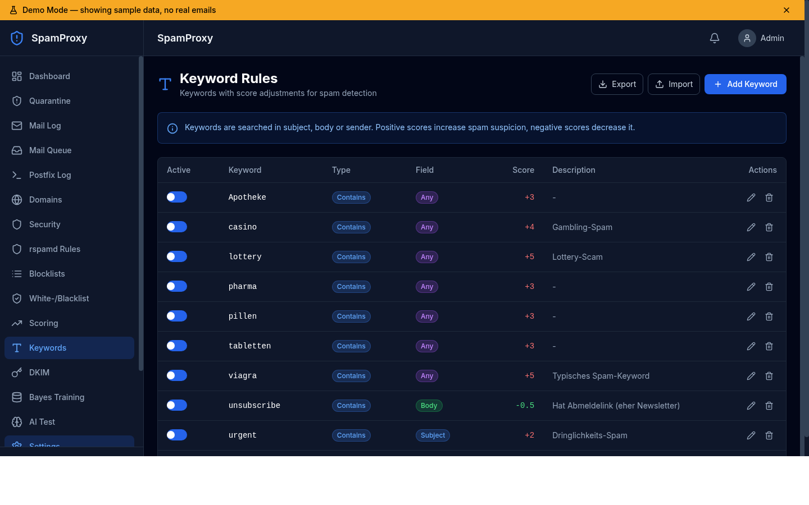 |
| Score Adjustments | Keyword Rules |
| 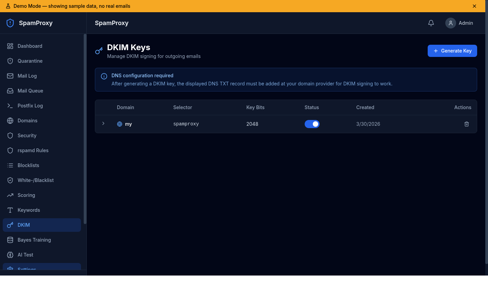 | 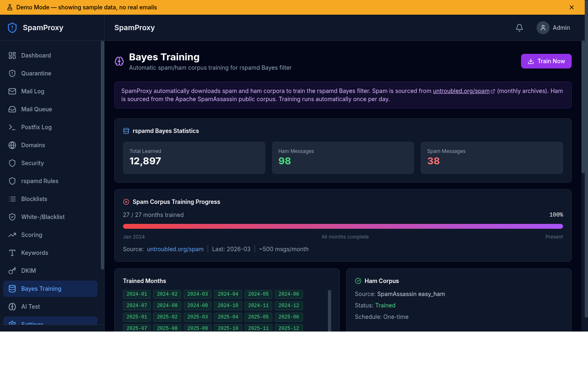 |
| DKIM Keys | Bayes Training |
| 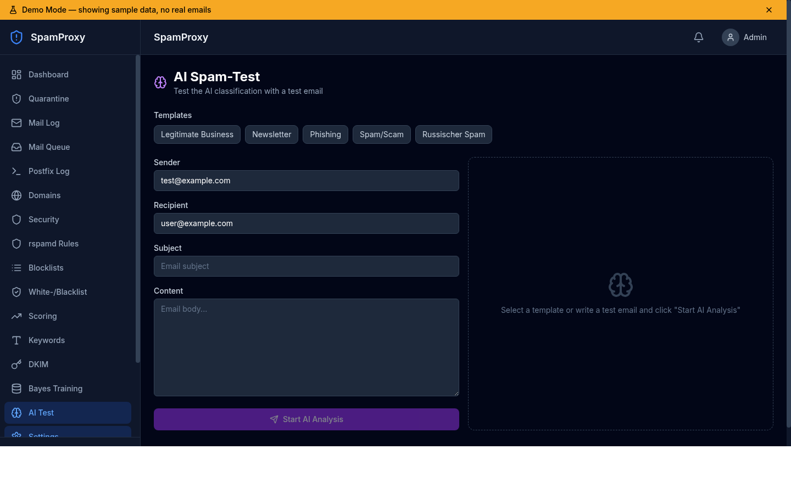 | 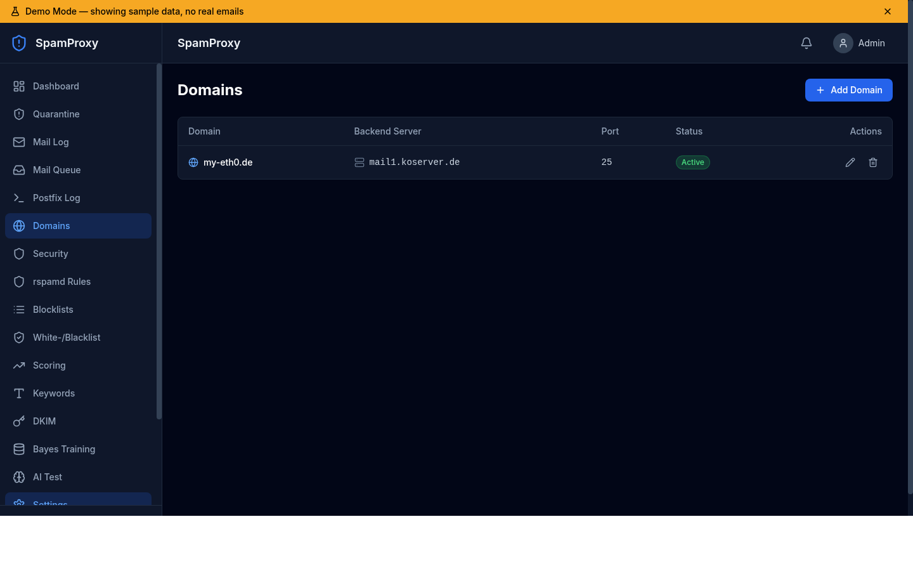 |
| AI Spam Test | Domain Routing |
| 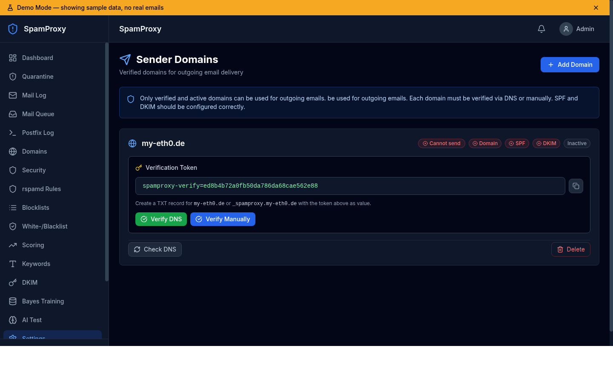 | 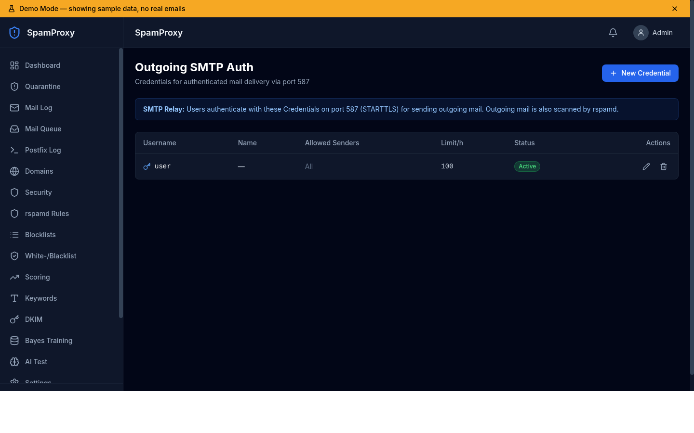 |
| Sender Domains | Outgoing SMTP Auth |
| 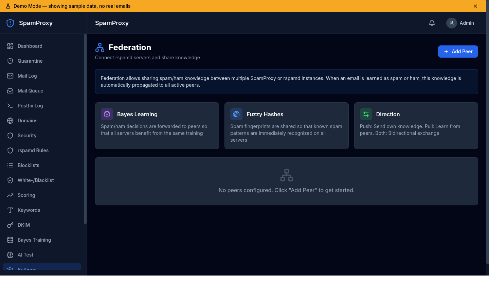 |  |
| Federation | Settings |

## Features

### Mail Processing
- **Postfix** as SMTP frontend (port 25 inbound, port 587 outbound with SASL auth)
- **rspamd** as milter for spam scoring (Bayes, fuzzy hashing, DKIM/SPF/DMARC)
- **AI classification** for grey-zone mails (OpenAI or Ollama)
- **ClamAV** virus scanner
- **Quarantine** with approve/reject in web interface
- **Content filter** logs every mail and decides: deliver / quarantine / reject

### DNS & Authentication
- **SPF verification** of incoming mails
- **DKIM signing** of outgoing mails (key generator in web interface)
- **DNS blocklists** (Spamhaus, Barracuda, SpamCop, SORBS, etc.)
- **Sender domain verification** for outgoing mail (DNS token or manual)
- **SMTP auth** for outgoing delivery (SASL via Dovecot protocol)

### Scoring & Filtering
- **Whitelist/Blacklist** for domains, emails, IPs, CIDR networks
- **TLD-based score adjustments** (e.g. .ru +3.0, .de -1.0)
- **Domain-based scoring rules**
- **Keyword-based scoring** with import/export
- **Per-domain backend routing** (each domain can have its own mail server)

### Scanner Clients (Centralized Scanning)
- **Remote scan engine**: Other mail servers can use SpamProxy as their centralized rspamd scanner
- **Encrypted communication** via curve25519 keypairs (generated in web interface)
- **No double scanning**: Client rspamd proxy forwards to SpamProxy, Postfix delivers locally
- **Scan history**: All scans (local + remote clients) visible in web interface with learn buttons
- **Keypair management**: Generate, view, and delete client keypairs in the web UI
- **Setup wizard**: Ready-to-use `worker-proxy.inc` config and step-by-step instructions

### Federation
- **Bayes learning sync** between multiple SpamProxy/rspamd instances
- **Fuzzy hash sharing** for spam fingerprints
- Push/Pull/Bidirectional mode
- Connection testing in web interface

### Web Interface
- **Dashboard** with real-time statistics and charts
- **Quarantine management** (list, preview, approve/reject, bulk actions)
- **Mail log** with filters and search
- **Postfix log** with auto-refresh and color highlighting
- **Domain management** (inbound routing per domain)
- **Security settings** (ClamAV, RBL, SPF, AI, DKIM toggles)
- **Blocklist management** (add/remove DNS blocklists)
- **Whitelist/Blacklist** (domains, IPs, emails)
- **Scoring rules** (TLD/domain-based)
- **Keyword rules** with import/export
- **DKIM key generator** with DNS record display
- **AI test** (classify test mails with templates)
- **Sender domain verification** with SPF/DKIM/MX checks
- **rspamd rules editor** (adjust symbol scores)
- **Bayes training** with automatic corpus download and Dovecot integration
- **Scan history** (all rspamd scans including remote clients, with learn buttons)
- **Mail queue** viewer with requeue/delete/hold actions
- **Delivery status** tracking (bounces, deferrals from Postfix log)
- **Outgoing auth management** (SMTP credentials)
- **Scanner clients** (manage remote scan clients with keypair generation)
- **Federation** (manage rspamd peers)
- **Demo mode** for screenshots without real data
- **General settings** (thresholds, AI config, etc.)

## Architecture

```
Internet ──► Port 25 ──► Postfix ──► rspamd (Milter) ──► Content Filter (Python)
                                                              │
                                                    ┌────────┼────────┐
                                                    ▼        ▼        ▼
                                                 Deliver  Quarantine  Reject
                                                    │        │
                                                    ▼        ▼
                                               Backend    PostgreSQL
                                              Mailserver    (DB)
                                                              │
Internet ──► Port 587 ──► Postfix (SASL) ──► rspamd ──► Content Filter
             (Submission)                                     │
                                                      Domain Check
                                                      (verified?)

Browser ──► Port 443 ──► Nginx ──► Next.js Web Interface
                                       │
                                       ▼
                                   mail-service (FastAPI)
                                       │
                                       ▼
                                   PostgreSQL
```

### Containers

| Service | Image | Ports | Purpose |
|---|---|---|---|
| postfix | Custom (Debian) | 25, 587 | SMTP relay with rspamd milter |
| rspamd | rspamd/rspamd | 11333*, 11334*, 11335* | Spam scanner |
| mail-service | Custom (Python) | 8024*, 8025*, 12345* | Content filter, API, SASL |
| web | Custom (Next.js) | 3177* | Web interface |
| postgres | PostgreSQL 17 | - | Database |
| redis | Redis 7 | - | rspamd backend (Bayes, fuzzy) |
| clamav | ClamAV | - | Virus scanner |

\* internal only or via Nginx

## Quick Start (Development)

```bash
cp .env.example .env
# Edit .env
docker compose up -d
# Web interface: http://localhost:3177
# Login: admin@example.com / changeme
```

## Production Deployment

### Prerequisites

- VPS with min. 2 GB RAM, 20 GB disk
- Domain with DNS access

Docker, Nginx and Certbot are installed automatically by the setup script.

### Installation

```bash
# 1. Clone to server
git clone https://github.com/JanKoIT/SpamProxy.git /opt/spamproxy
cd /opt/spamproxy

# 2. Run interactive setup (installs dependencies, configures everything)
./scripts/deploy.sh first-install

# 3. Set up DNS at your provider
# A record:   mail.example.com → VPS-IP
# MX record:  example.com → 10 mail.example.com
# SPF:        example.com TXT "v=spf1 a:mail.example.com ~all"

# 4. Set up automated backups
sudo ./scripts/setup-cron.sh
```

The setup wizard will prompt for hostname, admin email, password, and AI API key. It automatically:
- Generates secure passwords
- Installs Docker, Nginx, Certbot
- Builds and starts all containers
- Configures Nginx with TLS (Let's Encrypt)
- Sets up the firewall

### Update

```bash
cd /opt/spamproxy
./scripts/deploy.sh update
```

The update script:
1. Automatically pulls latest code from git
2. Creates a database backup
3. Rebuilds changed containers
4. Performs a rolling update (minimal downtime)

### Backup

```bash
# Manual backup
./scripts/backup.sh full        # Everything (DB + DKIM + Redis + config)
./scripts/backup.sh db          # Database only

# Set up automated backups
sudo ./scripts/setup-cron.sh    # Daily 02:00 full, every 6h DB

# Restore
./scripts/restore.sh backups/spamproxy_full_20260330.tar.gz
./scripts/restore.sh backup.tar.gz --component db    # DB only
```

### Federation

Connect multiple SpamProxy instances:

```bash
# On Server A: add Peer B
./scripts/deploy.sh federation-add 5.6.7.8 "Server-B"

# On Server B: add Peer A
./scripts/deploy.sh federation-add 1.2.3.4 "Server-A"

# Then configure peers in web interface under Settings > Federation
```

### Scanner Clients

Use SpamProxy as a centralized scan engine for other mail servers (no double scanning):

```bash
# 1. In the web interface: Settings > Scanner Clients > Add Client
#    This generates a keypair and shows the client config

# 2. On the SpamProxy server: open firewall for client IP
./scripts/deploy.sh federation-add <CLIENT-IP> "client-name"

# 3. Restart rspamd to load the new keypair
docker compose -f docker-compose.yml -f docker-compose.prod.yml restart rspamd

# 4. On the CLIENT server: install rspamd and apply the generated config
apt install rspamd
# Copy the worker-proxy.inc from the web interface to /etc/rspamd/local.d/
# Disable local scanning:
echo 'enabled = false;' > /etc/rspamd/local.d/worker-normal.inc
# Configure Postfix:
postconf -e 'smtpd_milters = inet:localhost:11332'
postconf -e 'milter_default_action = accept'
systemctl restart rspamd postfix
```

Mail flow: `Client Postfix → local rspamd proxy → SpamProxy rspamd (encrypted) → result back → Postfix delivers locally`

### Management

```bash
./scripts/deploy.sh status           # Service status
./scripts/deploy.sh logs             # All logs
./scripts/deploy.sh logs postfix     # Postfix only
./scripts/deploy.sh backup           # Manual backup
./scripts/deploy.sh federation-list  # Federation peers
```

## Configuration

### .env Variables

| Variable | Description | Default |
|---|---|---|
| `PROXY_HOSTNAME` | Proxy server hostname | proxy.example.com |
| `POSTGRES_PASSWORD` | PostgreSQL password | changeme |
| `NEXTAUTH_SECRET` | Session secret | (generated) |
| `ADMIN_EMAIL` | Admin login email | admin@example.com |
| `ADMIN_PASSWORD` | Admin password (first login) | changeme |
| `AI_PROVIDER` | openai or ollama | openai |
| `AI_API_KEY` | OpenAI API key | - |
| `AI_MODEL` | AI model | gpt-4o-mini |
| `QUARANTINE_RETENTION_DAYS` | Quarantine retention | 30 |
| `TZ` | Timezone | Europe/Berlin |
| `WEB_PORT` | Web interface port | 3177 |

### Web Interface Settings

Everything else is configured in the web interface:
- Spam thresholds (quarantine at score 5, reject at 10)
- AI grey zone (score 3-7 triggers AI analysis)
- ClamAV, RBL, SPF, DKIM on/off toggles
- Manage blocklists
- Adjust scoring rules and keywords
- Map domains to backend servers

## Security

- All internal ports (DB, Redis, rspamd, API) are not externally accessible
- Web interface only via Nginx/TLS
- HSTS, X-Frame-Options, CSP headers
- Rate limiting on web and federation endpoints
- bcrypt password hashing
- Federation ports restricted to peer IPs via UFW
- Sender domains must be verified for outgoing mail

## Tech Stack

- **SMTP**: Postfix
- **Spam Scanner**: rspamd
- **Virus Scanner**: ClamAV
- **Backend**: Python 3.12, FastAPI, SQLAlchemy, aiosmtpd
- **Frontend**: Next.js 15, TypeScript, Tailwind CSS, Recharts
- **Database**: PostgreSQL 17
- **Cache**: Redis 7
- **Deployment**: Docker Compose

## License

MIT
